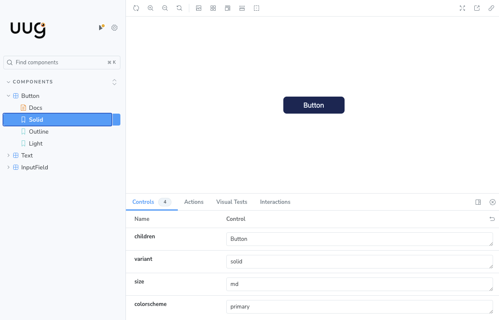

# UUG.AI's design system

This repository contains a design system that is used across various applications build by UUG.AI, the goal of this library is to centralise UI components and make them highly reuseable.

We have selected storybook as our design library of choice, as it allows us an easy way to add new components and review them over time.

## How to contribute

Clone the repository on your local working station.

    git clone https://github.com/uug-ai/ui

Make sure you have `node` (18.17.0 or higher) and `yarn` (yarn 4.x.x or higher) installed on your working station. Install the required dependencies, as following.

    cd ui
    yarn

After installing the dependencies run the `build` command to make a `.next` production build.

    yarn build

Finally you can start the storybook UI using the `storybook` command.

    yarn storybook

This will run the storybook interface on port `6006`.

## Frameworks

Within this projects we are using various tools:

- [TailwindCSS](https://tailwindcss.com)
- [Storybook](https://storybook.js.org)
- [ReactSVGIcon](https://reactsvgicons.com)
- [React-svgr](https://react-svgr.com)

### TailwindCSS

We use TailwindCSS for styling our components. TailwindCSS allows us to write utility-first CSS, making it easy to build responsive and customizable interfaces.

### Storybook

As mentioned before, we're using Storybook as our design library. Storybook eases the process of creating and reviewing components in isolation, which will eventually allow us to reuse these components in future projects.

### ReactSVGIcon

ReactSVGIcon is a library with many open source SVG icons for React applications making it easier to incorporate essential icons.

### ReactSVGR

React-svgr is a tool that transforms SVGs into React components. This allows us to convert unique SVGs into components with ease.
